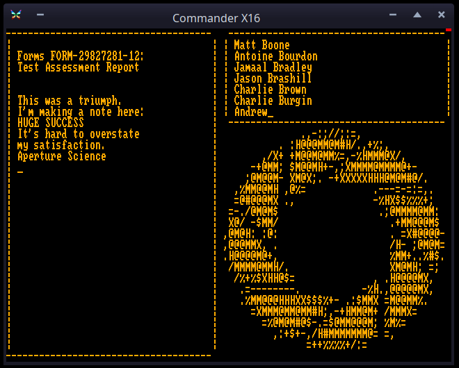

# Still Alive.

A version of the credit sequence of the 'Portal' videogame, for the Commander-X16.

Full credits are inside the demo itself :-)

*Why might this be interesting?*

- the credit sequence is more or less just an ascii terminal screen with scrolling text, so it lends itself perfectly to be replicated on a text mode computer screen. But it is also accompanied by a nice funny song. (can only be fully appreciated if you played the game though).
- in this presentation, there are 4 tasks running at the same time: the ascii art images slideshow, the lyrics window, the game credits window, and the playing of the song.
- the way it is programmed in Prog8 makes use of prog8's coroutines, where you can actually write those separate tasks as independent subroutines that will run together (interleaved) via the coroutine functionality.  So there was no need to create some sort of state machine or complicated timing and syncing code.

